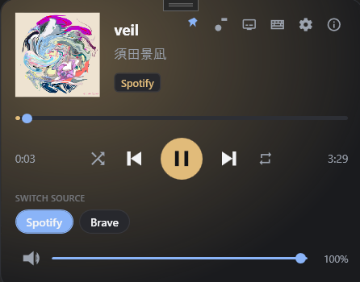
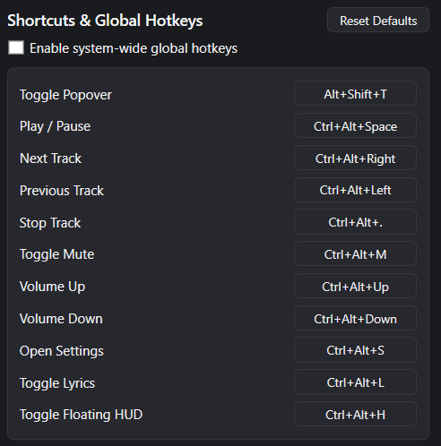
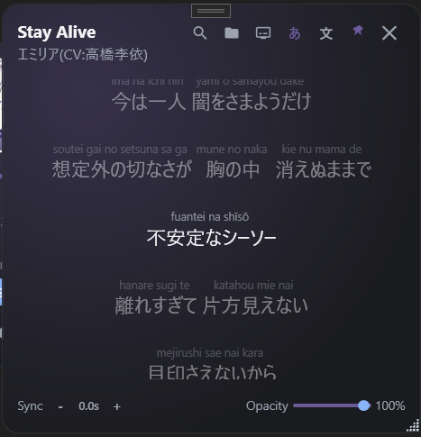

# TrackDot

**A tiny Windows tray app that controls your music.** Click the icon, get a floating popover with the current track, artwork, and playback controls — no taskbar button, no window to manage.


<br>

---

## The Story Behind It
 
Why build this? Simple: sheer frustration.

If you’ve ever switched between OS environments, you know that macOS and Linux make global media controls effortless. On Windows, however, controlling your background music on the fly without dedicated keyboard keys is surprisingly clunky. I wanted a quick, no-nonsense way to control playback globally without interrupting my workflow. That’s why this lives in cara-instan—scratching an itch with a fast, practical solution.

---

## What it does

TrackDot sits quietly in your system tray and surfaces **what's playing right now** through Windows' built-in media system (SMTC). It works with any player that publishes to SMTC — Spotify, Chrome, Edge, Groove, Windows Media Player, and VLC (with SMTC enabled).

| | |
|---|---|
| 🎵 **Now playing** | Title, artist, source app, album art |
| 🎮 **Transport** | Previous / Play–Pause / Stop / Next |
| 🔊 **Volume** | Per-source slider + mute, 5% steps |
| 📌 **Always there** | Tray-only — no taskbar clutter |
| ⌨️ **Hotkeys** | System-wide and local popover shortcuts |
| 🎤 **Lyrics** | Optional synced lyrics with Japanese romaji + furigana |

---

## See it in action

### The popover


*The floating popover — artwork, track info, progress bar, transport buttons, and volume.*

### Keyboard shortcuts


*A built-in reference window for every shortcut.*

### Synced lyrics (with Japanese support)


*Time-synced lyrics with romaji readings above each kanji/kana word.*

---

## Quick start

### 1. Install

Download the latest release from the [Releases](../../releases) page — pick **one**:

| Edition | Best for | What you get |
|---|---|---|
| **Installer** (`TrackDot-Setup-*.exe`) | Most users | Standard Windows installer; requires .NET 8 Desktop Runtime |
| **Portable** (`TrackDot-*-Portable.zip`) | USB sticks, locked-down machines | Self-contained ZIP; no install, no registry |

> The Installer is a small framework-dependent build. The Portable ZIP bundles everything and includes a `portable.dat` marker so settings stay next to the binary.

### 2. Launch

Double-click `TrackDot.exe` (or use the Start Menu shortcut from the installer).

**You won't see a window.** Look for the TrackDot icon in the notification area — usually at the right edge of the taskbar. It might be hidden under the `^` overflow arrow on Windows 11.

### 3. Click the icon

The popover appears above the tray. Play some music in any SMTC-aware player and the popover fills in. Click the icon again to hide.

---

## How to use it

### Tray icon

| Click | What happens |
|---|---|
| **Left-click** | Show / hide the popover |
| **Right-click** | Open the menu (Keyboard Shortcuts, Settings, About, Exit) |
| **Drag the popover** | Move it anywhere — your position is remembered |
| **Pin icon in the popover** | Keep it open across clicks elsewhere |

### Keyboard shortcuts

Open the full reference from **tray menu → Keyboard Shortcuts** any time. Highlights:

| Shortcut | Action |
|---|---|
| `Alt + Shift + T` | Toggle the popover from anywhere |
| `Ctrl + Alt + Space` | Play / Pause globally |
| `Ctrl + Alt + →` / `←` | Next / Previous track |
| `Ctrl + Alt + ↑` / `↓` | Volume up / down (5% steps) |
| `Ctrl + Alt + M` | Mute / unmute |
| `Esc` (with popover focused) | Hide the popover |

See [Keyboard Shortcuts & Global Hotkeys](#keyboard-shortcuts--global-hotkeys) below for the full list.

### Settings

**Tray menu → Settings** opens a single window with four sections:

- **Appearance** — System / Dark / Light theme
- **Popover Opacity** — Slider from 20% to 100%
- **Shortcuts** — Enable / disable system-wide hotkeys
- **Startup** — Launch TrackDot automatically when you sign in

All changes save instantly — no Apply button needed.

### Lyrics window

**Right-click the tray icon → Lyrics** (or the popover's lyrics button). Time-synced lyrics load from [lrclib.net](https://lrclib.net); Japanese tracks get romaji + furigana automatically. Opacity, topmost, and window position persist across launches.

---

## Requirements

| | |
|---|---|
| **OS** | Windows 10 (build 19041 or later) or Windows 11 — 64-bit |
| **.NET 8 Desktop Runtime** | Pre-installed on modern Windows 11. Bundled in the Portable edition. |
| **Player** | Any SMTC-publishing source — Spotify, Chrome/Edge, Groove, WMP, or VLC with SMTC integration enabled |

---

## What stays on your computer

**Nothing is uploaded.** TrackDot does not phone home, has no telemetry, and no analytics SDK.

- The only network call is the **lyrics window**, which fetches from `lrclib.net` only when you open it.
- Settings are stored in the Windows registry (`HKCU\Software\TrackDot`) — except in **Portable mode**, where they live in `settings.json` next to the executable.
- A crash log is written to `%LocalAppData%\TrackDot\crash.log` only if something goes wrong.

---

## For developers

<details>
<summary><strong>Build from source</strong></summary>

From a clean checkout in **git-bash** (or any POSIX shell):

```bash
cd "C:/Users/Herlandro Ando/Documents/Ando/sites_win/TrackDot"

# 1. Restore + build Debug.
dotnet restore TrackDot.sln
dotnet build TrackDot.sln -c Debug --no-restore

# 2. Run the full test suite (Debug).
dotnet test TrackDot.sln -c Debug --no-build

# 3. Confirm Release builds clean too.
dotnet build TrackDot.sln -c Release

# 4. Launch from the built binary (NOT `dotnet run`).
./bin/x64/Release/net8.0-windows10.0.19041.0/TrackDot.exe
```

Expected test result: **Passed: 293, Failed: 0, Skipped: 0** (both Debug and Release).
</details>

<details>
<summary><strong>Project layout</strong></summary>

```
TrackDot/
├── App.xaml(.cs)               Composition root, tray resources, exception-logger bootstrap
├── Views/                       View layer
│   ├── MainWindow.xaml(.cs)     Floating popover window
│   ├── SettingsWindow.xaml(.cs) Settings dialog (single-instance, hidden on close)
│   ├── HotkeysWindow.xaml(.cs)  Keyboard-shortcuts reference window
│   ├── AboutWindow.xaml(.cs)    About dialog
│   └── LyricsWindow.xaml(.cs)   Synced lyrics window (Kawazu romaji/furigana)
├── Commands/                    AsyncRelayCommand (ICommand wrapper with re-entrancy latch)
├── Converters/                  TimeSpanTextConverter, PlayPauseIconConverter
├── Models/                      Immutable records: snapshot, playback, capabilities,
│                                LyricLine, FuriganaSegment, AppThemeMode
├── Services/                    SMTC core, mapper, ThumbnailDecoder, ProgressInterpolator,
│                                SingleInstanceGuard, tray icon + handle, WindowPlacementService,
│                                UnhandledExceptionLogger, StartupService, registry adapter,
│                                AudioVolumeService, GlobalHotkeyService, LyricsService,
│                                WindowSettingsService, ThemeService + WpfThemePaletteApplier,
│                                IPopoverHost, PortableMode, FileUnhandledExceptionSink
├── ViewModels/                  MainViewModel, SettingsViewModel, LyricsViewModel
├── TrackDot.csproj              TFM net8.0-windows10.0.19041.0, x64, UseWPF=true
├── TrackDot.sln
└── tests/TrackDot.Tests/        293 xUnit tests; EnableDefaultCompileItems=false
```
</details>

<details>
<summary><strong>Architecture highlights</strong></summary>

- **ThemeService + WpfThemePaletteApplier split.** `IThemeService` is a pure state machine (System / Dark / Light); `WpfThemePaletteApplier` subscribes and translates into the WPF palette swap. The split keeps the state-machine unit-testable without WPF.
- **IPopoverHost.** The popover implements `IPopoverHost` and the tray icon's `Show / Hide` decisions read `IsPopoverVisible` through the host — *not* from a cached bool. A stale cache was the root cause of "I have to click the tray icon twice".
- **Settings storage split by concern.** `StartupService` owns `HKCU\…\Run\TrackDot`; `WindowSettingsService` owns `HKCU\Software\TrackDot`. Portable mode consolidates both into `settings.json`.
- **Global hotkeys are pinned to the popover HWND.** Registered via `RegisterHotKey` against the popover's `HwndSource`. Until the user opens the popover once, no HWND exists and global hotkeys silently no-op.
- **Lyrics is the only network feature.** `LyricsService` is the only place that constructs an `HttpClient`. Disable by never opening the lyrics window.
- **Volume lookup is PID-based, not AUMID-based.** A two-stage heuristic against `IAudioSessionManager2` matches the AUMID to a process and its renderer's display name — covers Spotify's renderer-process split and Electron players.
</details>

<details>
<summary><strong>Build pitfalls (development history)</strong></summary>

1. **Do not add `Microsoft.Windows.SDK.Contracts`** — `NETSDK1130` on .NET 5+; the TFM already carries WinRT projection.
2. **`dotnet test --no-build` after editing production + test files can hold a stale binary** — drop `--no-build` for one cycle if results look off.
3. **AsyncRelayCommand re-entrancy tests** — wrap `sut.Execute(null)` in `await Task.Run(...)` so the `async void` body escapes xUnit's `SynchronizationContext`.
4. **`BitmapDecoder` is ambiguous in WPF projects** — the decoder file aliases the WinRT one as `WinRTBitmapDecoder`. Do not remove the alias.
5. **`Application.MainWindow` collides with the `TrackDot.MainWindow` type name** — fully qualify as `TrackDot.MainWindow.IsShuttingDown = true`.
6. **`TaskbarIcon.IconSource` resolves via `pack://application:,,,/TrackDot;component/Assets/AppIcon.ico`** — bare paths only work at design time.
7. **`HKCU\…\Run` paths with spaces MUST be quoted** — the parser splits on whitespace otherwise.
8. **`Enable` opens the registry key TWICE** — once for `IsEnabled`, once for the write. Don't "optimize" by caching.
9. **Settings save-immediately contract** — every checkbox / slider / radio write goes straight to storage; failures must roll back the VM value AND show a `StatusMessage`.
10. **Portable mode is file-system based** — `File.Exists(<base>\portable.dat)`. To test on a developer machine, drop the marker into the bin output; removing it requires restart.
11. **Kawazu is a NuGet package whose IPA dictionary needs to land next to the binary** — the `CopyKawazuIpaDic` build target handles this. Do not `new KawazuConverter()` from `App.OnStartup` on a thread that has not loaded the dictionary.
12. **Global hotkeys need the popover opened once** — `RegisterHotKey` requires a window handle.
13. **`MediaControllerService` volume lookup is PID-based** — see Architecture above.
</details>

<details>
<summary><strong>Manual smoke matrix</strong></summary>

The automated xUnit suite covers contracts, lifecycle, and disposal — but it cannot exercise real SMTC sources, real displays, or real Windows behaviour. For the full integration matrix (Windows 10 / 11, Chrome / Edge / Spotify / VLC, multi-monitor, 100/125/150% DPI, 30-minute hidden soak, 15-minute playback soak, taskbar position), see [`docs/SMOKE_TEST.md`](docs/SMOKE_TEST.md).
</details>

<details>
<summary><strong>Publishing</strong></summary>

The end-to-end build is `scripts\build-release.ps1 -Version "0.1.0"` (PowerShell 7). It runs the tests, publishes, packages the Portable ZIP, and invokes Inno Setup if `ISCC.exe` is on the standard install path.

For a one-off local publish (framework-dependent):

```bash
dotnet publish TrackDot.csproj -c Release -r win-x64 --self-contained false \
    -o artifacts/win-x64-framework-dependent
```

**Do NOT enable trimming.** WPF / WinRT / reflection paths are trim-sensitive. Keep `PublishTrimmed=false` (the default).

See [`docs/RELEASE.md`](docs/RELEASE.md) for the full release pipeline.
</details>

---

## Keyboard Shortcuts & Global Hotkeys

### Global Hotkeys (System-Wide)

| Action | Hotkey |
|---|---|
| Toggle Popover | `Alt + Shift + T` |
| Play / Pause | `Ctrl + Alt + Space` |
| Next Track | `Ctrl + Alt + Right` |
| Previous Track | `Ctrl + Alt + Left` |
| Stop Track | `Ctrl + Alt + .` |
| Mute / Unmute | `Ctrl + Alt + M` |
| Volume Up / Down | `Ctrl + Alt + Up` / `Down` |
| Open Settings | `Ctrl + Alt + S` |

### Local Popover Shortcuts (when the popover is focused)

| Action | Keys |
|---|---|
| Play / Pause | `Space`, `K`, or hardware Media Play/Pause |
| Next Track | `Right Arrow`, `L`, or hardware Media Next |
| Previous Track | `Left Arrow`, `J`, or hardware Media Previous |
| Stop Track | `S`, or hardware Media Stop |
| Volume Up / Down | `Up Arrow` / `Down Arrow` |
| Mute / Unmute | `M` |
| Toggle Pin | `P` |
| Open Settings | `O` or `,` |
| Hide Popover | `Esc` |

---

## Known limitations

- **OS-selected session only.** TrackDot follows `GetCurrentSession()`. If Windows picks the wrong session (rare; usually when two SMTC sources are running and one has stale audio focus), TrackDot shows Windows' choice.
- **VLC needs SMTC enabled.** Toggle "Share media with Windows Media Player" in VLC's preferences, otherwise VLC won't appear as a source. Some VLC versions accept Previous / Next but ignore Stop.
- **Volume control requires an audio session.** Some SMTC sources (rare; mostly UWP media) do not own an audio session — the slider then shows the last value and writes are silently dropped.
- **Single source per process.** Manual source selection is deferred — the service contract already exposes `SourceAppUserModelId` so a picker could be added without changing the downstream contract.
- **Lyrics lookup is best-effort.** `lrclib.net` is community-maintained; not every track has synced lyrics, and Japanese tracks occasionally surface an English translation instead.

---

## License

MIT. See the repository header / package metadata.

- Tray icon component: [`Hardcodet.NotifyIcon.Wpf`](https://github.com/Hardcodet/notifyicon-wpf) 1.1.0 — MIT.
- Japanese romaji / furigana conversion: [`Kawazu`](https://github.com/herlandroando/Kawazu) 1.0.0 — IPA dictionary is bundled with the package.
- Lyrics lookup: [lrclib.net](https://lrclib.net) — public community-maintained LRC API.
